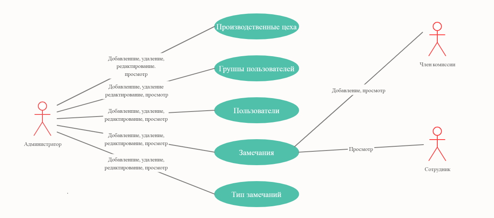
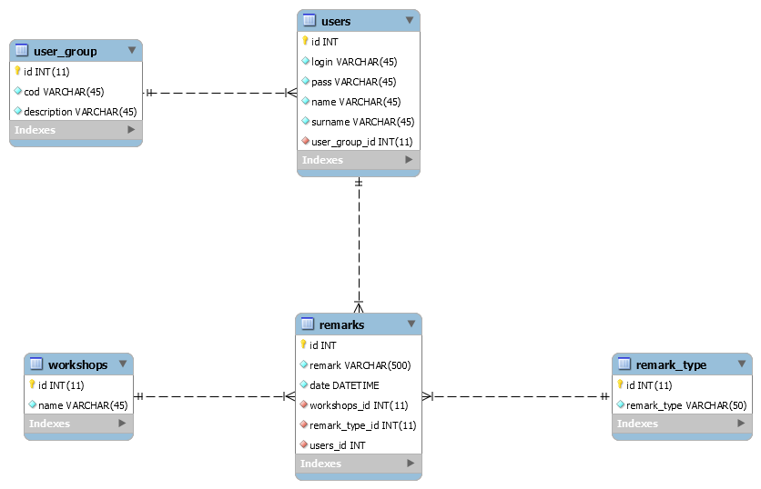

# Программа для формирования и хранения замечаний в базе данных

Данное веб-приложение разработано для сбора ихранения замечаний по рациональному использованию топливно-энергетических ресурсов на конкретном предприятии. Оно может быть адаптировано под другие подобные цели на любом другом объекте.

В процессе создания программы были спользованы следующие технологии:
* PHP 7.2
* SQL
* CSS 3, SASS

## Use case диаграмма проекта

## ER диаграмма проекта

